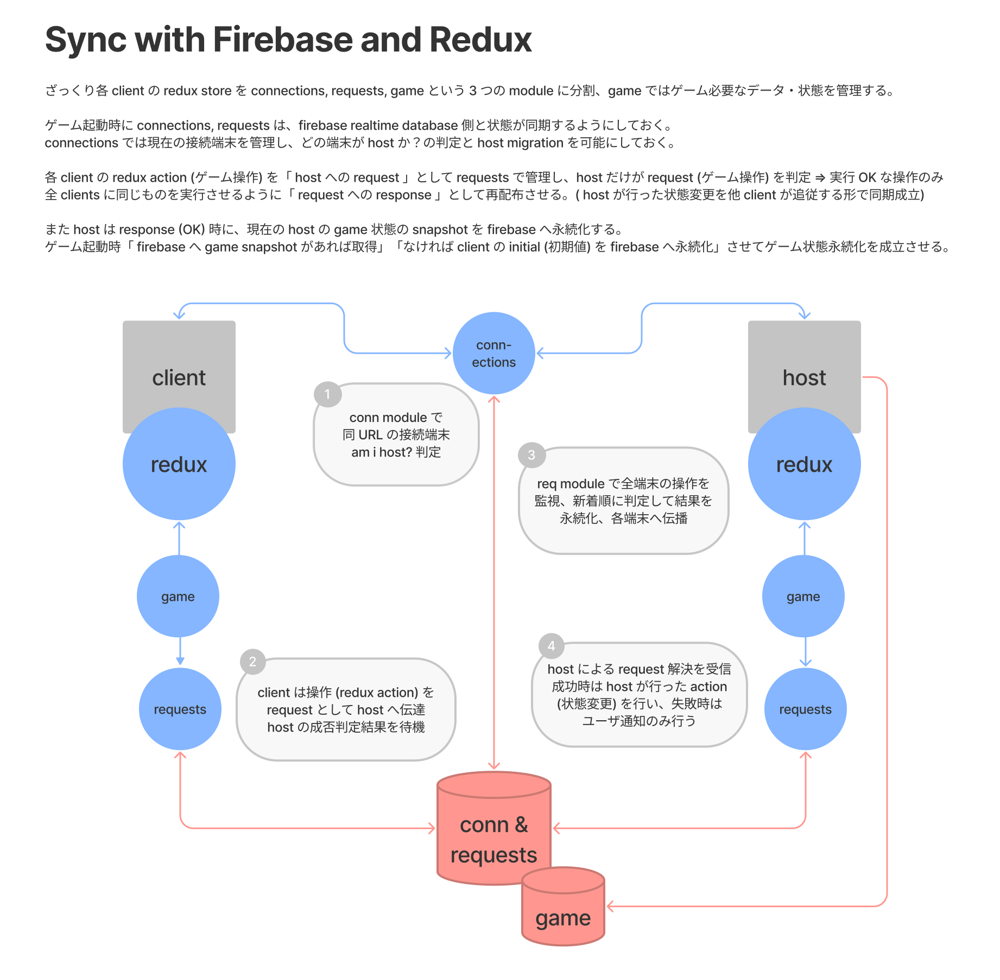

# SPEC: requests 同期基盤

## Overview

端末間 synced state 同期基盤の仕様。仕組み・前提知識・既知の問題・設計ガイドラインをまとめる。core は transport 抽象にのみ依存し (`docs/SPEC-public-api.md`)、Firebase Realtime Database は adapter 実装の 1 つ (Phase 2 で提供予定)。本文の firebase 表記は「最初の transport 実装」としての説明であり、仕組み自体は infra 非依存。

- 目的: 同期まわりの不具合調査・改修時に「どこまでが設計意図で、どこからがバグか」を即判断できる状態にする
- 詳細はコードとその周辺コメントを正とし、本書は「どこを読めばよいか」と「なぜ成り立つか」だけを示す

### 同期モデルの選定

採用しているのは Server / Client 方式のうち**クライアントホスト型 (リレーサーバ)**。専用サーバ型と比べてサーバの開発・保守運用コストを丸ごとカットでき、協力型・ターン制の少人数マルチプレイに向く。反面 host に負荷とロジックが集中するため、同期速度・平等性が重視されるリアルタイム対戦には不向き。P2P・専用サーバ型との比較と選定背景は下図を参照。


## 前提知識

各要素の一言概要と「だから何が成り立つか」。詳細は対応ファイルへ。

- **action の request 化** — `src/core/create-synqux.ts` (`actionRequestMiddleware`)
    - synced domain action を横取りして transport へ push し、ローカル適用を中断する。楽観更新をしない
    - → 画面に出る state は常に「同期済み state」であり、画面と判定 state の恒常的なズレが構造上起きない
- **host 決定ロジック** — `src/core/host.ts` (`deriveHostId`)
    - 全端末が共有する peer pool から「最新接続の dedicated、いなければ最新接続の player」を host とする純粋関数 (observer は昇格しない)
    - → 選挙プロトコルなしで全端末が同じ host に合意でき、host 離脱時も pool の変化だけで自動的に次の host が定まる (host migration)
- **各端末の request 処理 fork** — `src/core/create-synqux.ts` (`requestListener`)
    - 全端末が未応答 request ごとに永続 fork を持ち、「自分が host か」「先行 request (prev) が処理済みか」を 100ms ループで監視し続ける
    - → host 不在・migration 中に届いた request も、誰かが host に昇格した時点で処理される。キュー処理のような排他制御を分散環境で実現している
- **順序保証 (prev チェーンと revisions)** — `src/core/ordering.ts`, `src/core/create-synqux.ts` (`responseListener`)
    - transport のイベント順序は信頼せず、host が観測した順序を request の `prev` に焼き込む。各端末は「prev が処理済みリストに入るまで待つ」ことで適用順を線形化する
    - → 到着順がバラついても全端末の適用順は host 基準で一致する。revisions (snapshot 封筒の `ordering.revisions`) は「実際に適用された順序」の ground truth。順序判定は Phase 3 の host 採番 seq 化に備えて `ordering.ts` に隔離されている
- **reducer の作り方 (validation = result)** — `src/core/results.ts` (`stateWithError` / `generateResult`)
    - reducer は logic validation に失敗したら state を変えず `state.result` に error を積む。host は `rootReducer` を試し実行し、`selectSynced(next).result.type` (`error` / `success`) で request の受理・拒否を判定する
    - → 成否判定器は reducer ただ一つ。host / client / 同期なし (standalone) でロジックが分岐せず、reducer さえ堅牢なら同期しても壊れない
- **snapshot と restore** — `src/core/snapshot.ts`, `src/core/create-synqux.ts` (`subscribe` / `persistSnapshot`)
    - host は request を 1 件処理するたびに synced state 全体を canonical JSON の封筒で永続化する。復帰端末は snapshot + revisions を復元し、それ以降の requests だけを購読して追いつく
    - → 途中参加・リロード・host migration をまたいでも状態と順序保証が継続する

## 同期の仕組み

クライアントホスト型を Redux × transport で実現する。redux store は「synqux 内部 slice (`state.synqux` = 接続端末の管理と受信 request の置き場)」と「consumer の synced slice (同期対象状態)」に分かれ、peers と requests を transport と同期させる。全体コンセプトは下図 (移植元の firebase 構成の図。connections/requests/game は state.synqux.connections / state.synqux.requests / synced slice に対応)、action 1 件が適用されるまでの流れは後述のシーケンスの通り。



```txt
client                      firebase                     host
  |  game action dispatch      |                           |
  |--(actionRequestMiddleware)-|                           |
  |  ※ローカル適用せず中断        |                           |
  |        createRequest ----->|                           |
  |                            |--- child_added ---------->|
  |                            |     (requestListenerMiddleware)
  |                            |     rootReducer で成否判定    |
  |                            |<-- responseToRequest ------|  result/prev/responsedBy 付与
  |                            |<-- updateGameState --------|  snapshot 永続化
  |<-- child_changed ----------|                           |
  |  (responseListenerMiddleware)                          |
  |  request.action を dispatch = ここで初めて全端末に適用       |
```

### 不変条件 (これが破れたらバグ)

1. game state を書き換える action は、必ず request → response → dispatch の経路を通る (`meta.requestedBy` 付与済み action のみ素通し)
2. 各 request は全端末で**高々 1 回**適用される
3. 適用順序は全端末で host の prev チェーンに一致する
4. revisions (snapshot 封筒の `ordering.revisions`) は適用履歴と一致する

### 設計上の割り切り

- **順序保証を優先し、遅延 request は意図的に落とす** (`isDelayedRequestId`)。復帰不能な順序破壊よりも「操作 1 回の取りこぼし」を軽症とみなす
- したがって「タイマー等で 1 度しか発火しない action」は禁止。state 監視で retry するか、ユーザ操作で dispatch させる作りにする
- `result.type === 'error' && console` の request は dispatch せず `console.error` へ流す (連打・遅延で弾かれた操作の通知はノイズのため)

## 既知の問題

### 対策済み (実装内で吸収している)

| 問題 | 対策 | 場所 |
| --- | --- | --- |
| added の prevKey (infra 観測順) が信頼できない | host 観測順を `prev` に焼き込み全端末が追従 | `src/core/create-synqux.ts` |
| added の重複配送 (遅延後に重複) | 同一 prevKey の added を `acceptAdded` ガードで破棄 | `src/core/ordering.ts` / 受信ルーティング |
| restore 時に responsedBy 付き request が added で届く | changed 相当として振り分け | `src/core/create-synqux.ts` (受信ルーティング) |
| restore 時、購読先頭 request の prevKey が null | snapshot の revision を prev として補完 | `src/core/create-synqux.ts` (受信ルーティング) |
| 遅延 request が後から処理されると復帰不能になる | `ordering.isDelayed` で意図的にドロップ (→②の副作用あり) | `src/core/ordering.ts` |
| ① revisions の二重記録: host の response ack が遅延すると、local echo で先行した responseListener 側の記録と `concat` が同一 id を隣接ペアで二重追記する | snapshot へ載せる revisions を ack await の**前**に評価固定 (synqux Phase 1 で修正) | `src/core/create-synqux.ts` (requestListener)、再現テスト: `src/core/characterization.test.ts` |
| ①′ responseListener の二重 dispatch 窓: check-then-act (isApplied チェック → dispatch → await → markApplied) の窓に同一 changed の同時二重配送が入ると二重適用され、**非冪等 action が静かに壊れる** | dispatch 直前に同期的な処理中ガード (`ordering.beginProcessing`) を立て、markApplied 後 finally で解放 (synqux Phase 1 で修正)。失敗時は解放して再配送での retry 余地を残す | `src/core/create-synqux.ts` (responseListener) / `src/core/ordering.ts`、再現テスト: `src/core/characterization.test.ts` |

### 発生確認済み・未修正

#### ② clock skew による request の取りこぼし

- **症状**: host migration 直後、旧端末が送った request が誰にも応答されず消える
- **原因**: push id は端末時計に依存するため、時計がズレた端末間で id の大小と実時間が逆転し、`isDelayedRequestId` が正当な request をドロップする
- **影響**: migration 境界の数秒間、ユーザ操作が無言で消え得る。楽観更新をしていないため画面が嘘をつくことはない
- **位置づけ**: 順序破壊を防ぐための既知トレードオフ。修正するなら host 採番の連番比較などが必要でコスト大。当面は明文化にとどめる

NOTE: `REVISIONS.push` 自体を dispatch 前へ前倒しする案は不可 (dispatch 失敗時にその request が全端末で永久欠落し、prev チェーンが途切れる)。①′の処理中ガードは「成功時は二重適用を防ぎ、失敗時は retry 可能性を残す」ために採られた形であり、prev 待機ループの途中で立ててはいけない (待機中に fork が死ぬと誰もその request を処理できなくなる)。

## 設計ガイドライン

同期基盤の性質から導かれる、game action / reducer 設計のルール。

1. **現在値に依存する action を作らない**: `toggle` ではなく `set({ key, value })`。UI イベントに乗っているユーザ意図をそのまま payload に載せる。冪等な action は重複配送・再クリック・遅延のすべてに耐える
2. **1 度しか発火しない自動 dispatch を作らない**: 取りこぼし前提の基盤のため、state 監視 + retry かユーザ操作起点にする
3. **判定系 action は入力のスナップショットを result / log に残す**: 「現在 state を見て判定する」action は、判定時点の入力を記録しておくと replay 再現なしで調査が終わる
4. **validation は reducer に集約し、`stateWithError` で表現する**: middleware や UI 側に成否判定を分散させない。reducer が唯一の判定器であることが同期の前提

## 改善ロードマップ

優先順。背景は既知の問題・設計ガイドラインを参照。

1. **冪等性テストハーネス**: action を「二重適用 / ドロップ」して不変条件を検証する test utility を用意し、非冪等 action を CI で検出できるようにする
2. ~~**既知の問題の修正**: ①の concat 評価固定 / ①′の処理中 Set ガード~~ → **Phase 1 で対応済み** (対策済みの表を参照)。consumer 側の toggle 系 action の set 化は残タスク
3. **host 採番の連番導入**: push id + 端末時計依存の順序判定をやめ、②の取りこぼしクラスを根絶する (Phase 3、ADR-0001 Decision 10)
4. **同時操作の負荷実測**: 想定人数での prev チェーン直列処理のスループットと遅延を計測し、進行設計で吸収できるか判断する
5. **snapshot 書き込み削減**: 全量 JSON set を N request ごと・差分永続化などへ (帯域コストが問題化してから)

## Trouble Shooting: 同期不具合の調査手順

requests / game state の export があれば、端末ログなしで大半を確定できる。

1. **requests export と state export を取る** (`requests/{gameId}` と `games/{gameId}`。state は JSON 文字列として格納されている点に注意)
2. **まず requestedBy / responsedBy を見る**: 誰が操作し、誰が host だったか。複数プレイヤー交錯説・host migration の有無はここで数分で判定できる
3. **`game.revisions` を実適用順の正として使う**: push id 順や export の並びは信頼しない。revisions 順で action を replay し、最終 state と一致するか確認する (一致すれば「記録された action が記録された順に 1 回ずつ適用された」ことが確定する)
4. **異常データの照合**: revisions の重複 (→①の隣接ペアか)、requests にあって revisions に無い id (→②のドロップか)、`result.type` を確認する
5. **ユーザ報告と突き合わせる**: UI は controlled で楽観更新なしのため、「画面に見えていた state」=「その端末の同期済み state」。request の payload は「ユーザが物理的に操作した対象」そのものなので、操作列から意図を復元できる
